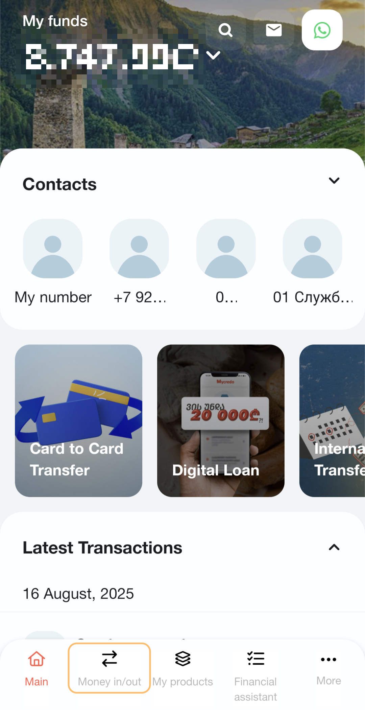
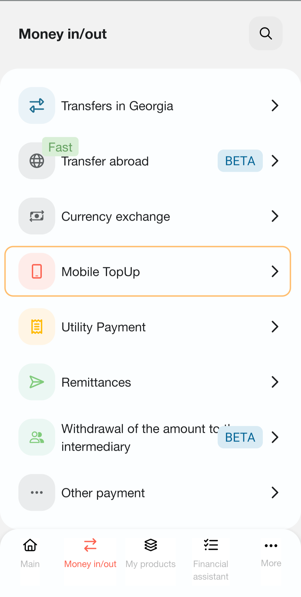
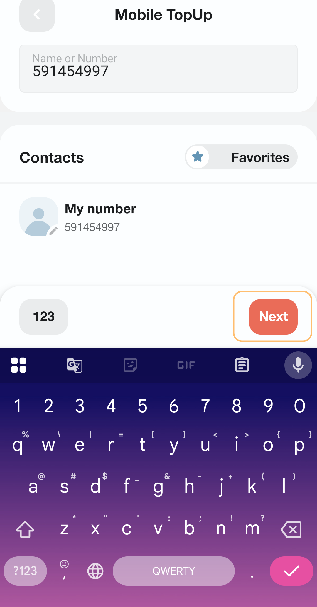
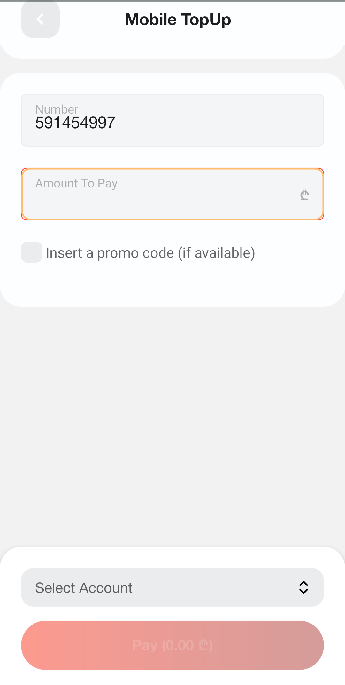
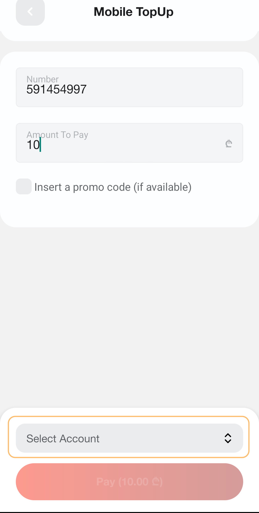
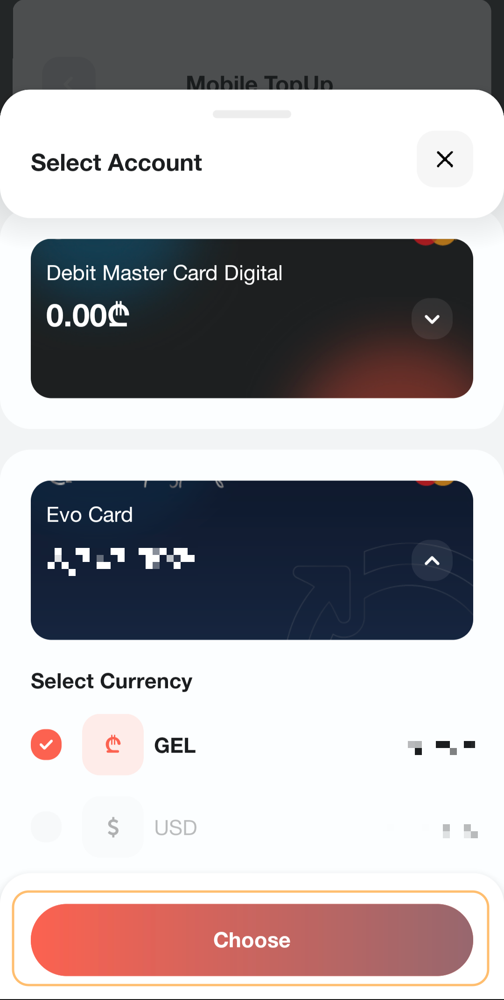
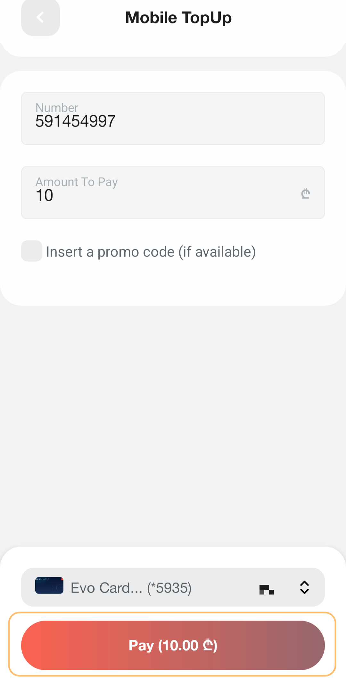
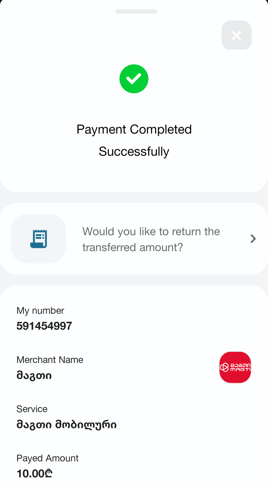

# How to make a mobile topup

With this user guide, you learn how to pay online.

As a reference, we use the process of making a mobile top-up in [the Credo Bank mobile app](https://credobank.ge/en/services/internet-mobile-bank).

## 1. Choose the "Money in/out" option

<section class="section">
After logging in to the Credo Bank mobile app, click on "Money in/out".  

</section>

## 2. Choose the "Mobile TopUp" option

<section class="section">
In the "Money in/out" page, click on "Mobile TopUp".

</section>

## 3. Find a necessary mobile number

<section class="section">
In the "Mobile TopUp" page, find the necessary mobile number. You can type manually or choose one from your contacts. Then, click the "Next" button.

</section>

## 4. Write the necessary amount to pay

<section class="section">
In the checkout page, write the necessary amount in the "Amount to Pay" field.

</section>

## 5. Select a necessary account

<section class="section">
Then, in the same page, click "Select Account".

</section>

## 6. Choose an account and a currency

<section class="section">
In the accounts page, click on your necessary account. Inside the account option, choose a currency.

</section>

## 7. Make a payment

<section class="section">
After choosing the account, you return to the checkout page. To make a payment, check the data and click the "Pay" button.

</section>

## 8. Receive a confirmation

<section class="section">
After the payment, the confirmation page opens.

</section>
